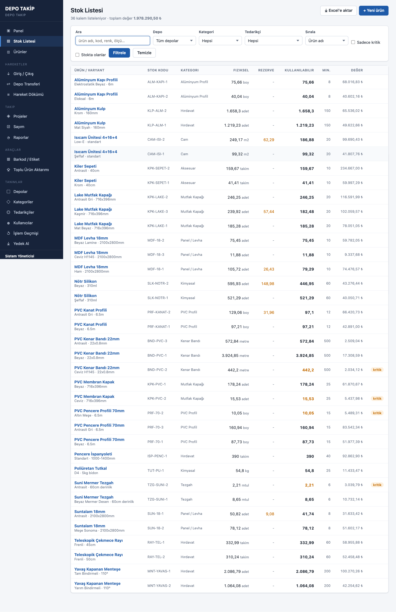
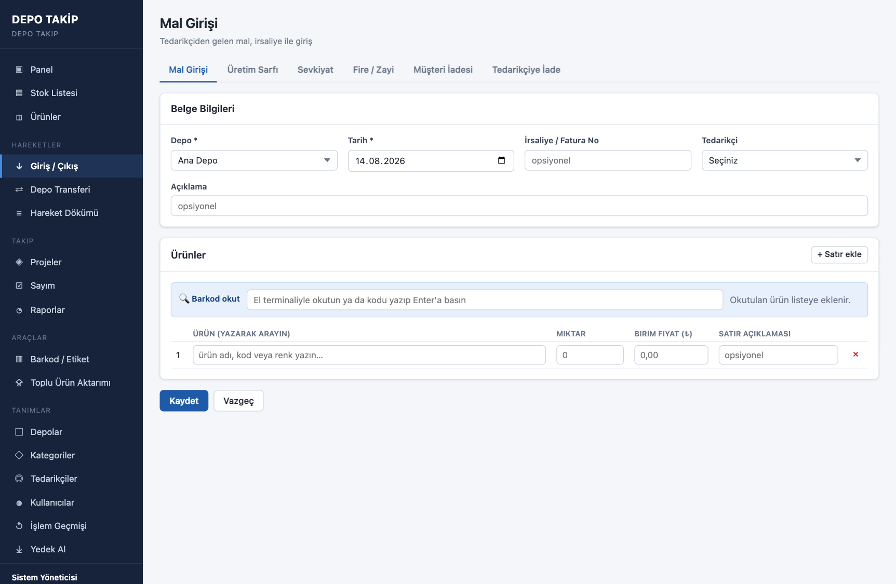
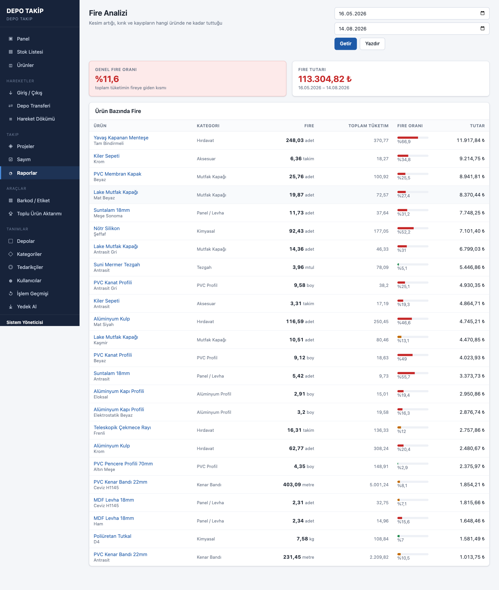
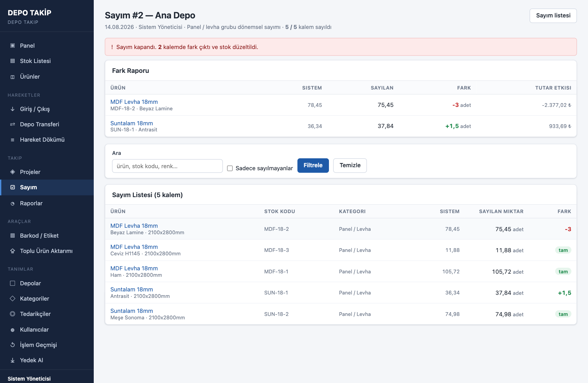

# Depo Takip Sistemi

Mobilya imalatı yapan bir üretim işletmesi için geliştirilmiş, yerel ağda çalışan depo ve stok yönetim sistemi. Elle tutulan defter kayıtlarının, gün sonu tablo aktarımlarının ve ay sonu sayım düzeltmelerinin yerini alır.

Zorunlu staj kapsamında, gerçek bir işletmenin ihtiyaçları dinlenerek tasarlandı ve geliştirildi.

## Temel tasarım kararı

**Stok miktarı hiçbir tabloda saklanmaz.** Her sorguda hareket defterinden hesaplanır.

Giriş, sarf, fire, transfer, sayım düzeltmesi ve iade kayıtları işaretli miktarlar olarak tutulur; anlık stok bu kayıtların SQL görünümleriyle toplanmasından çıkar. Böylece tek doğruluk kaynağı hareket geçmişidir — stok ile hareketler arasında tutarsızlık oluşması yapısal olarak mümkün değildir.

Aynı sebeple **yanlış kayıt silinmez**, ters kayıtla iptal edilir (storno). Geçmiş her zaman olduğu gibi kalır.

## Özellikler

- **Ürün ve varyant hiyerarşisi** — aynı levhanın renk/dekor varyantları ayrı stok kalemi olarak izlenir
- **Proje bazlı rezervasyon** — iş emrine malzeme ayrılır; fiziksel, rezerve ve kullanılabilir miktar ayrı ayrı görünür
- **Körlemesine sayım** — sayım yapan kişiye sistem miktarı gösterilmez, fark sonradan hesaplanır
- **Raporlar** — sipariş önerisi, fire analizi, stok değeri, hareket özeti, proje maliyeti
- **Barkod ve raf etiketi** — Code 128 üretimi ve yazdırma
- **CSV toplu aktarım** — önce kontrol raporu, onaydan sonra kayıt
- **Yedekleme** — tek dosyaya alma ve geri yükleme
- **Rol bazlı yetki** — yönetici, depo sorumlusu, usta
- **Türkçe'ye duyarlı arama** — büyük/küçük harf ve Türkçe karakter farkı gözetmez ("çekmece" ile "ÇEKMECE" aynı sonucu verir)

## Ekran görüntüleri

| | |
|---|---|
|  |  |
| Stok listesi — arama ve filtreleme | Mal girişi — çok satırlı kalem girişi |
|  |  |
| Fire analizi raporu | Tamamlanmış sayımın fark raporu |

## Teknoloji

| | |
|---|---|
| Dil | Python 3.9+ |
| Web çatısı | Flask |
| Veritabanı | SQLite (standart kütüphane) |
| Şablon | Jinja2 |
| Arayüz | HTML/CSS + sade JavaScript (çatı kullanılmadı) |
| Parola | pbkdf2:sha256 |

İki harici bağımlılık vardır: Flask ve python-barcode (Code 128 üretimi). İnternet bağlantısı gerektirmez.

## Kurulum

```bash
python3 -m venv .venv
.venv/bin/pip install -r requirements.txt
.venv/bin/python kurulum.py     # veritabanını demo veriyle kurar
.venv/bin/python app.py
```

Tarayıcıdan `http://127.0.0.1:5051` adresine gidin.

> Port 5051 kullanılıyor çünkü 5000 macOS'ta AirPlay tarafından kullanılıyor. `PORT` ortam değişkeniyle değiştirilebilir.

**Demo giriş:** kullanıcı `admin`, parola `admin123`
Bu bilgiler yalnızca `kurulum.py` ile üretilen demo verisi içindir. Gerçek kullanımda ilk iş parolayı değiştirmektir.

## Test

```bash
python testler.py
```

Geçici bir veritabanı üzerinde uçtan uca duman testi çalıştırır: **119 kontrol noktası.**

## Proje yapısı

```
app.py           Uygulama fabrikası
db.py            Veri erişim katmanı ve arama
auth.py          Oturum yönetimi
guvenlik.py      Yetki kontrolü ve parola özetleme
schema.sql       11 tablo + 3 görünüm
kurulum.py       Veritabanı kurulumu ve demo veri
testler.py       Test paketi
bolumler/        10 modül — panel, stok, urunler, hareketler, projeler,
                 sayim, raporlar, barkod, aktarim, tanimlar
templates/       33 Jinja2 şablonu
static/          CSS ve JavaScript
```

Kod ve veritabanı adlandırması tamamen Türkçedir.

## Ölçek

Yaklaşık 7.800 satır: 3.875 Python, 3.079 HTML şablon, 679 CSS/JS, 202 SQL. 57 dosya.
